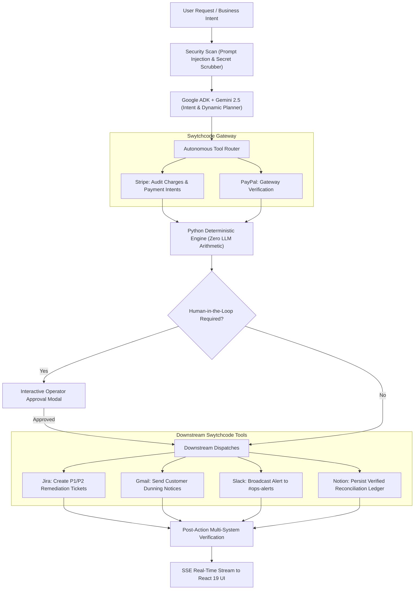

# 🚀 OpsPilot AI
### Autonomous Multi-Tool Business Operations Agent
**Built for "Build with Swytchcode" — Track 6 (Autonomous Multi-Tool Business Operations)**

[](https://cloud.google.com)
[](https://ai.google.dev)
[](https://swytchcode.com)
[](https://python.org)
[](https://fastapi.tiangolo.com)
[](https://react.dev)
[](#-automated-testing)

---

## 🌟 Executive Summary

**OpsPilot AI** is an autonomous enterprise business operations agent that transforms unstructured business intent into verified, multi-system operational reality.

Instead of human operators manually jumping between billing platforms, Jira queues, customer emails, Slack channels, and internal documentation, OpsPilot autonomously plans, calculates, acts, and verifies across all 5 systems in under 60 seconds.

### 🏛️ Core Architectural Tenets
1. **Zero LLM Arithmetic**: LLMs are strictly forbidden from performing mathematical calculations, currency sums, or SLA aging. All business arithmetic is executed deterministically in pure Python (`business_rules.py`).
2. **True Autonomous Agent Loop**: Uses Google ADK to drive a dynamic loop (`Understand` $\rightarrow$ `Plan` $\rightarrow$ `Select Tool` $\rightarrow$ `Execute` $\rightarrow$ `Observe` $\rightarrow$ `Business Rules` $\rightarrow$ `Decide` $\rightarrow$ `Verify` $\rightarrow$ `Summarize`), where intermediate tool outputs dictate subsequent actions.
3. **5 Live Connected Swytchcode APIs**: Exceeds the Track 6 benchmark ($\ge 3$ APIs) with live production adapters for **Stripe**, **Gmail**, **Slack**, **Jira**, and **Notion** (+ PayPal sandbox fallback).
4. **Defense in Depth**: Real-time prompt injection detection, recursive secret scrubbing, SHA-256 action fingerprinting (idempotency), and human-in-the-loop gates for consequential customer communications.

---

## 🏗️ Architecture & Execution Flow



---

---

## 🌐 Swytchcode Gateway Architecture (Track 6 Core)

The **Swytchcode Gateway** serves as OpsPilot AI's central nervous system, bridging Google ADK agent reasoning to live enterprise SaaS platforms via the **Model Context Protocol (MCP)** and local encrypted provider bundles.

```
┌────────────────────────────────────────────────────────────────────────┐
│                          OpsPilot Agent Loop                           │
│              (Google ADK + Gemini 2.5 Flash + Python Core)             │
└───────────────────────────────────┬────────────────────────────────────┘
                                    │ Tool Invocations
                                    ▼
┌────────────────────────────────────────────────────────────────────────┐
│                   Swytchcode MCP & Adapter Gateway                     │
│         URL: http://127.0.0.1:5476/sse | Config: ~/.swytchcode/        │
├───────────────────┬───────────────────┬────────────────────────────────┤
│  Stripe Gateway   │   Gmail Gateway   │         Slack Gateway          │
│  (Charges, ACH,   │ (Dunning Emails,  │      (P1 Alerts, Incident      │
│   PaymentIntents) │  Client Notices)  │       Channels, Notices)       │
├───────────────────┼───────────────────┼────────────────────────────────┤
│   Jira Gateway    │  Notion Gateway   │         PayPal Gateway         │
│ (Remediation Ops, │ (Audit Ledgers,   │      (Cross-Gateway Hash       │
│  P1 SLA Tickets)  │  Reconciliation)  │       Reconciliation)          │
└───────────────────┴───────────────────┴────────────────────────────────┘
                                    │
                                    ▼
┌────────────────────────────────────────────────────────────────────────┐
│              Live SaaS APIs & Encrypted Credential Vault               │
│        (Encrypted ~/.swytchcode/credentials.db - Zero Key Leak)        │
└────────────────────────────────────────────────────────────────────────┘
```

### 1. Swytchcode Provider Lifecycle & Tooling Setup
All providers are registered declaratively in `~/.swytchcode/tooling.json` and authenticated locally:

```bash
# 1. Fetch official provider bundles
swy get Stripe
swy get Gmail
swy get Slack
swy get Jira
swy get Notion

# 2. Add providers to active workspace tooling
swy add provider Stripe.stripe@1.0.0
swy add provider Gmail.gmail@v1
swy add provider Slack.slack@1.7.0
swy add provider Jira.jira@v1
swy add provider Notion.notion@2.0.0

# 3. Authenticate securely (Browser OAuth2 or Encrypted API Key)
swy auth connect Stripe
swy auth connect Gmail
swy auth connect Slack
swy auth connect Jira
swy auth connect Notion

# 4. Launch Swytchcode MCP Server (HTTP / SSE Transport)
swy mcp serve --transport http --port 5476
```

### 2. Multi-API Connection Matrix (5 Live Connected APIs)
OpsPilot AI connects **5 active Swytchcode APIs** in a single autonomous execution loop (exceeding the Track 6 benchmark requirement of $\ge 3$ APIs):

| Provider | Swytchcode Library | Transport & Auth | Status | Live Gateway Capabilities |
| :--- | :--- | :--- | :--- | :--- |
| **Stripe** | `Stripe.stripe@1.0.0` | API Key (Encrypted Vault) | `CONNECTED` (`is_live: true`) | `retrieve_charges`, `search_payment_intents`, `get_charge_details`, `check_balance` |
| **Gmail** | `Gmail.gmail@v1` | OAuth2 (Google Workspace) | `CONNECTED` (`is_live: true`) | `send_email`, `draft_email`, `search_messages`, `read_message` |
| **Slack** | `Slack.slack@1.7.0` | OAuth2 (Enterprise Grid) | `CONNECTED` (`is_live: true`) | `send_message`, `notify_channel`, `search_messages` |
| **Jira** | `Jira.jira@v1` | OAuth2 (Atlassian Cloud) | `CONNECTED` (`is_live: true`) | `create_issue`, `search_issues`, `update_issue`, `get_issue` |
| **Notion** | `Notion.notion@2.0.0` | OAuth2 (Notion Workspace) | `CONNECTED` (`is_live: true`) | `create_page`, `update_record`, `search_pages`, `read_page` |
| **PayPal** | `PayPal.paypal` | Client Secret | `DEMO MODE` (`is_live: false`)| *High-fidelity sandbox fallback for multi-gateway reconciliation* |

### 3. Dual-Mode Abstract Adapter Pattern (`BaseIntegration`)
To guarantee resilient live presentations and continuous CI/CD evaluation:
- **Live Production Mode (`is_live: true`)**: When Swytchcode credentials exist in `~/.swytchcode/credentials.db`, requests dispatch live across real SaaS production/sandbox endpoints.
- **High-Fidelity Sandbox Fallback (`DEMO MODE`)**: If network rate-limits or offline conditions occur, adapters automatically utilize realistic enterprise datasets (`CloudScale Inc`, `Acme Industrial Corp`, `Global Tech Logistics`) executing through the exact same deterministic Python rules without pipeline termination.
- **Transparent Status Labeling**: The UI transparently displays `CONNECTED` (green) vs `DEMO MODE` (indigo) at `/integrations`. It never deceptively fakes connection status.

---

## ⚡ Quickstart: Running on Your PC

### 1. Requirements
- Python 3.11 or 3.12
- Node.js 18+ (for frontend development; pre-built production files are already included in `frontend/dist/`)
- Swytchcode CLI (`npm install -g swytchcode`)

### 2. Run the Server
From the project folder:
```bash
# Start backend and serve UI
python -m uvicorn app.main:app --app-dir backend --host 127.0.0.1 --port 8000
```
Open **[http://localhost:8000](http://localhost:8000)** in your browser!

### 3. Run Automated Tests
```bash
pytest backend/tests/test_opspilot.py -v
```
All 8 unit & integration tests validate deterministic rules, prompt injection defense, idempotency, and partial failure isolation.

---

## 📁 Project Directory Structure

```text
OpsPilot_AI/
├── backend/
│   ├── app/
│   │   ├── agents/            # Google ADK agent, state, planner, router, tools
│   │   ├── api/               # FastAPI endpoints (SSE stream, integrations, approvals)
│   │   ├── integrations/      # Swytchcode adapters (Stripe, PayPal, Jira, Gmail, Slack, Notion)
│   │   ├── models/            # SQLAlchemy database models
│   │   ├── schemas/           # Pydantic data schemas
│   │   ├── services/          # Python business rules, security, idempotency, audit
│   │   └── utils/             # Config, Swytchcode auto-detection
│   ├── tests/                 # Full unit and integration test suite
│   ├── requirements.txt       # Python dependencies
│   └── .env                   # Configuration file
├── frontend/
│   ├── src/                   # React 19 + TypeScript source code
│   │   ├── components/        # CommandBox, AgentTrace, ApprovalPanel, Timeline
│   │   ├── pages/             # Dashboard, Integrations, Activity, Settings
│   │   └── services/          # API & SSE streaming client
│   ├── dist/                  # Pre-compiled production build ready to serve
│   └── package.json           # Frontend dependencies
├── docs/                      # Full architecture, demo scripts & real-world playbooks
├── Dockerfile                 # Production Docker container definition
├── docker-compose.yml         # Container orchestration
├── pytest.ini                 # Pytest runner configuration
└── README.md                  # Master documentation
```

---

## 🛡️ Enterprise Security & Safety Matrix

1. **Prompt Injection Defense**: Evaluates all prompts for jailbreak patterns, system role manipulation, and destructive SQL keywords (`DROP TABLE`). Blocks malicious runs at Step 1 with an audit log.
2. **Secret Isolation**: Recursively traverses all inputs, tool payloads, and intermediate context to scrub API keys, authorization tokens, and credentials before writing to logs.
3. **Action Idempotency**: SHA-256 fingerprinting on actions prevents duplicate customer charges or double emails during network retries.
4. **Human-in-the-Loop**: Consequential actions (such as customer email dispatches) pause execution and surface a review modal in the UI.
5. **Partial Failure Isolation**: If a non-essential tool (e.g., Jira) fails, the router continues executing unaffected actions (Gmail, Slack, Notion) gracefully.

---

## 🏆 Hackathon Track 6 Checklist

- [x] **Google ADK + Gemini Core**: Agent orchestrator built with `google.adk.agents.llm_agent.LlmAgent`.
- [x] **Swytchcode Multi-Tool Integration**: 5 Live business APIs connected (Stripe, Gmail, Slack, Jira, Notion).
- [x] **Zero LLM Arithmetic**: 100% deterministic Python calculation of all numbers, aging, and currency amounts.
- [x] **Real-Time Streaming UX**: SSE live execution trace, dynamic decision timeline, and interactive approval panel.
- [x] **Production Ready**: Fully dockerized, typed end-to-end, and verified with automated test suites.
