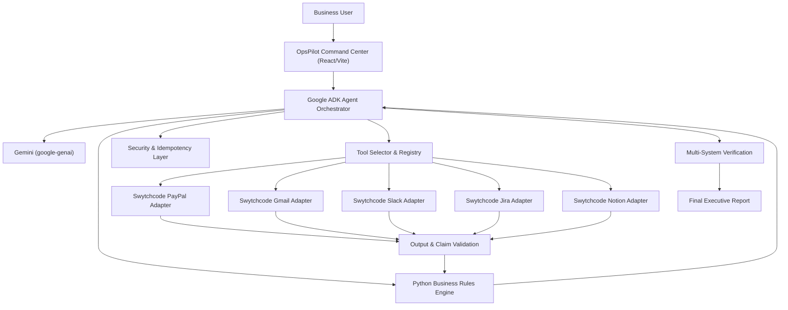

# OpsPilot AI — Master Architecture

> "From Business Intent to Autonomous Execution."

OpsPilot AI is built for **Build with Swytchcode (Gurgaon Edition) — Track 6: AI Business Operator Agent**.

## Architectural Principle: LLM ≠ Source of Truth

Traditional naive implementations entrust generative LLMs with financial logic, calculations, and operational states, leading to hallucinations, security exploits, and non-deterministic behavior. OpsPilot AI implements a strict separation of concerns:

```
Google ADK (Orchestration)
      ↓
Gemini (Natural Language Understanding & Qualitative Synthesis)
      ↓
Python Core (Deterministic Ground Truth, Rules, SLA, Validation)
      ↓
Security Engine (Prompt Injection Defense, Sanitization, Secret Scrubbing)
      ↓
Swytchcode (Business Integration Execution & Tool Adapters)
```

---

## Architectural Diagram



---

## Subsystem Responsibilities

### 1. Google ADK (`google-adk 2.9.2`)
- **Agent Orchestration**: Maintains loop iteration, state history, step transitions, and execution budgets.
- **Tool Coordination**: Wraps `FunctionTool` with strongly-typed parameter schemas and input/output contracts.
- **Human Confirmation**: Interfaces with approval gates for consequential actions (batch customer emails).
- **Event Streaming**: Dispatches real-time SSE events for visible command center tracing.

### 2. Gemini (`google-genai`)
- **Intent Interpretation**: Categorizes complex natural language intent.
- **Qualitative Explanation**: Translates technical errors and edge conditions into accessible business summaries.
- **Zero Arithmetic Guarantee**: Prohibited from computing totals, counts, or financial aggregates.

### 3. Python Deterministic Core (`services/business_rules.py`)
- **Financial Calculations**: Sum of at-risk balances, failed payment counts, pending SLA elapsed days.
- **Classification Engine**:
  - `COMPLETED`: No action needed.
  - `PENDING`: Evaluate age against SLA (3-day threshold).
  - `FAILED`: Priority scoring (`CRITICAL`, `HIGH`, `MEDIUM`) based on amount ($500 threshold), customer tier (Enterprise vs Standard), and failure codes.
- **Payload Generators**: Deterministically structures Jira task bodies, Gmail messages, Slack channel alerts, and Notion pages.

### 4. Security & Safety Layer (`services/security.py`, `services/idempotency.py`)
- **Prompt Injection Defense**: Regex and heuristic scanners reject system-override attempts.
- **Secret Isolation**: Sensitive credentials reside strictly in environment variables and are scrubbed from all logs, databases, and client payloads.
- **Idempotency**: SHA-256 fingerprinting prevents duplicate actions (no redundant Jira tasks or customer emails).
- **Execution Limits**: `MAX_AGENT_STEPS=25`, `MAX_TOOL_RETRIES=3`, `TOOL_TIMEOUT=30s`.

### 5. Swytchcode Integration Layer (`integrations/`)
- Unified abstract interface (`BaseIntegration`).
- Supports both Live Swytchcode Cloud endpoints and offline high-fidelity Demo Mode with 15 synthetic payments across 10 business accounts.
- Honest labeling: `CONNECTED` vs `DEMO MODE`.
